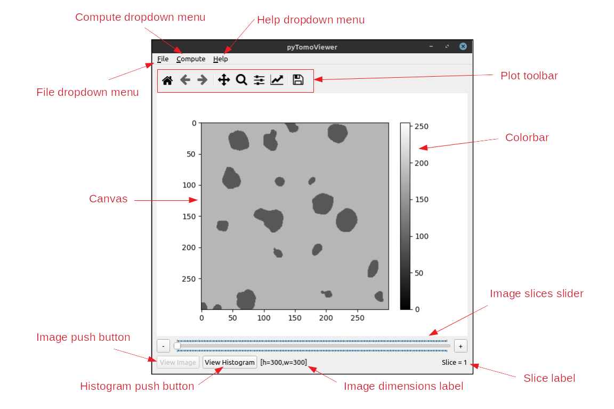
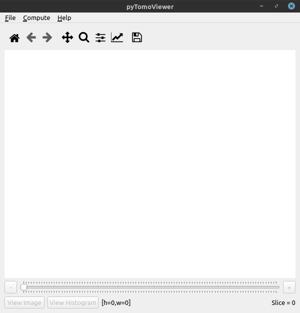
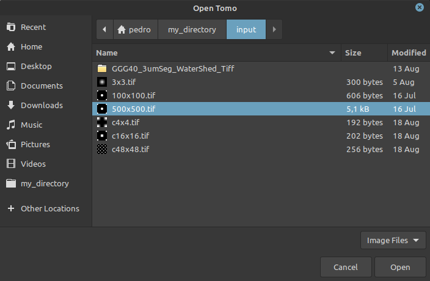
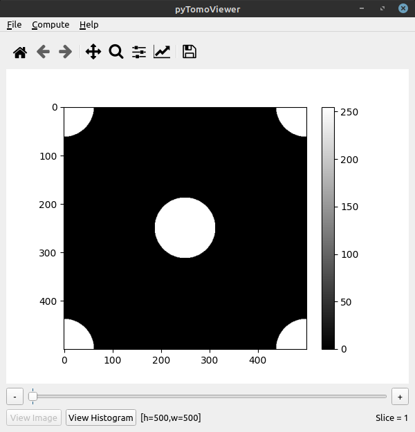
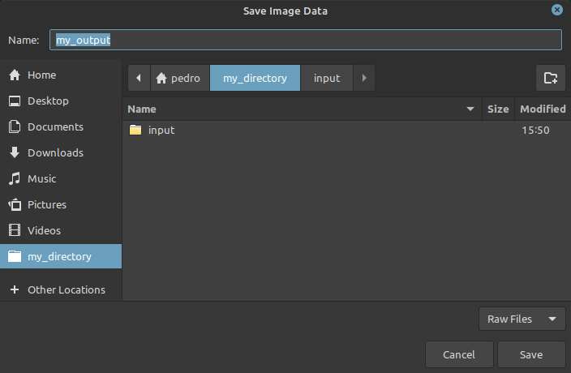
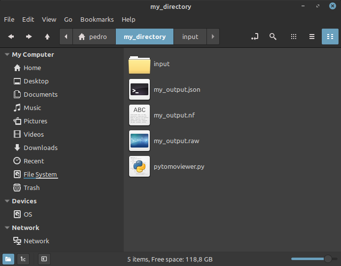

# pytomoviewer

[](https://github.com/LCC-UFF/pytomoviewer/blob/master/LICENSE)

## Introduction

pytomoviewer is an open-source [Python](https://www.python.org/) script implementation for the visualization of micro-computed tomographic images, from TIFF files, and a converter from TIFF to binary RAW files, where the image is represented with an 8-bit grayscale. The components on the Graphical User Interface (GUI) developed in [PyQt5](https://www.riverbankcomputing.com/software/pyqt/) and [Matplotlib](https://matplotlib.org/), as well as their purpose, are exposed in this document. Also, a quick example of usage of the software is presented.

## Important notes and features

+ The code now works with Python 3.8.2. All you need to do is to check out the master branch;
+ Interactive visualization of micro-CT data;
+ Visualize the image stack;
+ Generation of image histograms;
+ Fast export to RAW format (including a header file in JSON format); 
+ Direct image resampling; 
+ Identification and removal of unconnected cluster of porous from the whole volume;
+ Simple generation of 3D data by replicating a single TIFF image; 
+ Conversion of a full grayscale image into a binary image.


## Installation

The pytomoviewer tool and its dependencies can be installed using:

```
pip install git+https://github.com/LCC-UFF/pytomoviewer
```

## How to run

After installation, you can launch pytomoviewer by using the following command from a terminal: 

```
python -c 'import pytomoviewer as ptv; ptv.run()'
```

## Graphical User Interface (GUI) components

<a name="figure1"><div id="figure1"></div></a>
<p align="center">
  
</p>
<p align="center">Figure 1: The GUI of pytomoviewer.</p>

The components presented in <a href="#figure1">Figure 1</a>, in clockwise direction, are:

**Canvas:** Graphical component where an image read from TIFF files is displayed with an 8-bit color scale representation.

**File dropdown menu:** This dropdown menu has three buttons. From top to bottom:
- **Open:** This push button opens an auxiliary dialog for users to browse for a TIFF file, or a stack of TIFF files, that represent, respectively, a 2D or 3D image.
- **Export:** This push button opens an auxiliary dialog for users to browse for a directory on which three output files will be created and placed. In addition to generating a binary RAW file that represents the original image, read from a TIFF file, or a stack of TIFF files, pytomoviewer provides a JSON and a Neutral file, that can be used as input for numerical analysis software. This button does nothing if no image has been read.
- **Exit:** This push button finishes and closes pytomoviewer.

**Compute dropdown menu:** This dropdown menu has two buttons. From top to bottom:
- **Replicate image:** This push button opens an auxiliary dialog for users to enter a number of copies to generate from the image being displayed, creating a stack of images. This is useful to expand 2D images to 3D. This button does nothing if no image has been read.
- **Remove unconnected pores:** This push button runs a filter that removes unconnected pores from the current image (2D), or stack of images (3D). This is useful to generate input for fluid analysis software. This button does nothing if no image has been read.
- **Convert to binary image:** This push button opens an auxiliary dialog for users to enter a threshold (between 0 and 255) to perform a global segmentation (binarization) using the histogram data, and then generating binary images. This is useful to convert a full gray-scale image in a binary image, very practical in fluid analysis software. This button does nothing if no image has been read.

**Help dropdown menu:** This dropdown menu has a single button, About, that opens an auxiliary dialog with information about pytomoviewer. There, users can find the version, year of release, license and a disclaimer regarding the program.

**Plot toolbar:** A set of push buttons and toggle buttons provided by [Matplotlib](https://matplotlib.org/) for [PyQt5](https://www.riverbankcomputing.com/software/pyqt/) to manage options related to the graphical components used to display images. From left to right:
- **Reset original view:** This push button restores image display on *Canvas* to initial view.
- **Back to previous view:** Undo the last action performed on *Canvas*, such as Pan and Zoom.
- **Forward to next view:** Redo the last undone action performed on *Canvas*.
- **Pan/Zoom:** When this toggle button is on, cursor movements on *Canvas*, coupled with the left mouse button being pressed down, move the image, whilst if the right mouse button is pressed down, zoom is performed.
- **Zoom to rectangle:** When this toggle button is on, mouse clicks and cursor movements on *Canvas* are enabled to define a rectangle to which the image will be zoomed in.
- **Configure subplots:** This push button opens an auxiliary dialog to manage subplot properties.
- **Edit axis, curve and image parameters:** This push button opens an auxiliary dialog to manage *Canvas* and image properties.
- **Save figure:** This push button opens an auxiliary dialog to save the current view on *Canvas* to a PNG file.

**Colorbar:** An axis to relate a color scale to 8-bit numerical values.

**Image slices slider:** A slider to select which slice of a 3D image should be displayed on *Canvas*. This is useful to navigate through the long sequence (stack) of tomographic images. For single 2D images, this component has only one possible value (the only slice that can be displayed is the image itself).

**Slice label:** A label to indicate the identifier of the slice being shown on *Canvas*.

**Image dimensions label:** A label to indicate the dimensions (height and width), in pixels, of the slice being shown on *Canvas*.

**Histogram push button:** This push button plots, on *Canvas*, a histogram of the color scale being used to represent an image, or stack of images, read from TIFF files. It is only enabled when an image is displayed on *Canvas*.

**Image push button:** This push button plots, on *Canvas*, an 8-bit representation of an image, or stack of images, read from TIFF files. It is only enabled when a histogram is displayed on *Canvas*.

## Example usage

On this section, an example of how to use the pytomoviewer application is presented, from starting the program to generating output files. It is required that Python and some specific libraries are installed.

1. Launching pytomoviewer

Users may start the pytomoviewer app in two fashions.

a) Calling pytomoviewer with Python, from the command prompt.
+ Browse through your directories until you reach the location on pytomoviewer.py
+ Start the command prompt at this directory (or navigate to it: $ cd your/directory/here).
+ Start the app with Python: $ python pytomoviewer.py
P.S.: If you have both Python 2 and Python 3 installed, it is recommended to run pytomoviewer with Python 3. In that case, substitute python with python3 on the command line presented above.

```
python3 pytomoviewer.py
```


b) Opening pytomoviewer (<a href="#figure2">Figure 2</a>) with Python via mouse clicks (on Windows systems). This can be done by right clicking on the pytomoviewer.py file and selecting *open with*, followed by Python. If your default action to open a .py file is with Python (not with an IDE, for example) double-clicking on pytomoviewer.py will also work.


<a name="figure2"><div id="figure2"></div></a>
<p align="center">
  
</p>
<p align="center">Figure 2: pytomoviewer.</p>

2. Opening an image from TIFF files

	To open an image, or a stack of images, from TIFF files, users must click on the *Open* button, at the *File* dropdown menu. This will open a dialog to browse for the wanted TIFF files. To open a single image, simply select it (<a href="#figure3">Figure 3</a>). The selected figure will be displayed on *Canvas* (<a href="#figure3">Figure 4</a>). To open a stack of images (representing a 3D image), use multiple selection, with the *Shift* key, for example.

<a name="figure3"><div id="figure3"></div></a>
<p align="center">
  
</p>
<p align="center">Figure 3: Dialog to browse for TIFF files.</p>

<a name="figure4"><div id="figure4"></div></a>
<p align="center">
  
</p>
<p align="center">Figure 4: Image read from a TIFF file.</p>

3. Exporting a binary RAW file

	To export a binary RAW file generated from a TIFF file, or a stack of TIFF files, representing the original image with an 8-bit grayscale, users must click on the *Export* button, at the *File* dropdown menu. This will open a dialog to browse for a directory (<a href="#figure5">Figure 5</a>) where the output files will be placed (<a href="#figure6">Figure 6</a>). In addition to the binary RAW file, pytomoviewer also creates a JSON and a Neutral file, that can be used as input for numerical analysis software.

<a name="figure5"><div id="figure5"></div></a>
<p align="center">
  
</p>
<p align="center">Figure 5: Dialog to browse for a repository to place output files.</p>

<a name="figure6"><div id="figure6"></div></a>
<p align="center">
  
</p>
<p align="center">Figure 6: Output files provided by pytomoviewer.</p>

## Acknowledgements
This research was carried out in association with the ongoing R&D project registered as ANP nº 21289-4, “Desenvolvimento de modelos matemáticos, estatísticos e computacionais para o aperfeiçoamento da caracterização petrofísica de reservatórios por Ressonância Magnética Nuclear (RMN)" (UFF/Shell Brasil/ANP), sponsored by Shell Brasil under the ANP R&D levy as “Compromisso de Investimentos com Pesquisa e Desenvolvimento”. The authors also recognize the support from CAPES, CNPq and FAPERJ.
