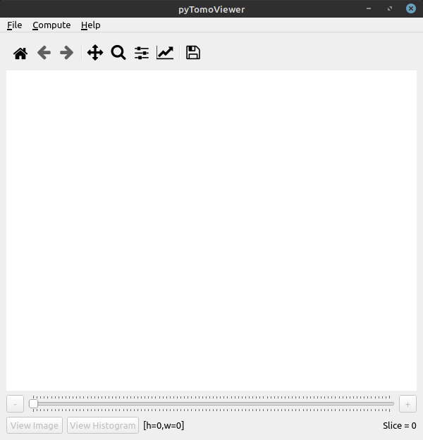
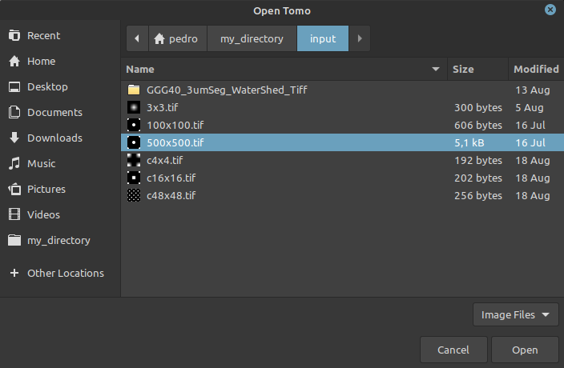
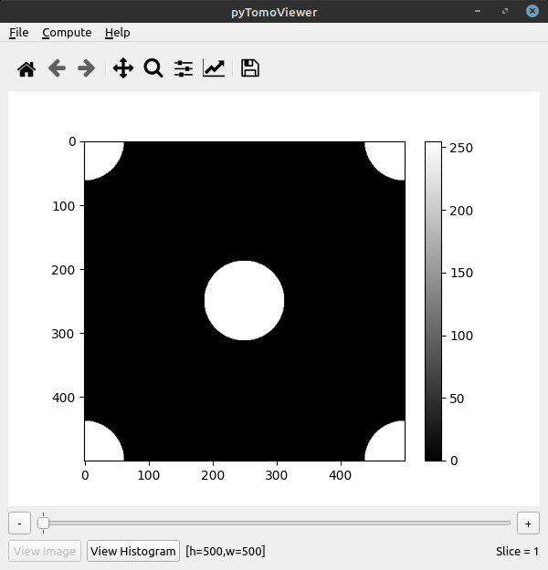

# Welcome to pytomoviewer

pytomoviewer is an open-source [Python](https://www.python.org/) script implementation for the visualization of micro-computed tomographic images, from TIFF files, and a converter from TIFF to binary RAW files, where the image is represented with an 8-bit grayscale. The components on the Graphical User Interface (GUI) developed in [PyQt5](https://www.riverbankcomputing.com/software/pyqt/) and [Matplotlib](https://matplotlib.org/), as well as their purpose, are exposed in this document. Also, a quick example of usage of the software is presented.

# Performance Tips


## Requirements

The following libraries are required, which are likely already installed on your system:
+ [Python 3](https://www.python.org/)
+ [JSON](https://docs.python.org/3/library/json.html)
+ [NumPy](https://numpy.org/)
+ [SciPy](https://www.scipy.org/)
+ [PyQt5](https://www.riverbankcomputing.com/software/pyqt/) incl. QtCore, QtGui and QtWidgets
+ [Matplotlib](https://matplotlib.org/)


## Installation

The libraries can be installed using the provided ``requirements.txt``:

```
git clone https://github.com/LCC-UFF/pytomoviewer
cd pytomoviewer
pip3 install -r requirements.txt
pip3 install .
```

## How to run

### Linux or Windows

A Python script can be executed at command line by invoking the interpreter on your application.

From the directory containing pytomoviewer.py run: 

```
python3 pytomoviewer.py
```

## Example usage

On this section, an example of how to use the pytomoviewer application is presented, from starting the program to generating output files. It is required that Python and some specific libraries are installed.

1. Launching pytomoviewer

Users may start the pytomoviewer app in two fashions.

a) Calling pytomoviewer with Python, from the command prompt.
+ Browse through your directories until you reach the location on pytomoviewer.py
+ Start the command prompt at this directory (or navigate to it: $ cd your/directory/here).
+ Start the app with Python: $ python pytomoviewer.py
P.S.: If you have both Python 2 and Python 3 installed, it is recommended to run pytomoviewer with Python 3. In that case, substitute python with python3 on the command line presented above.

```
python3 pytomoviewer.py
```


b) Opening pytomoviewer (<a href="#figure1">Figure 1</a>) with Python via mouse clicks (on Windows systems). This can be done by right clicking on the pytomoviewer.py file and selecting *open with*, followed by Python. If your default action to open a .py file is with Python (not with an IDE, for example) double-clicking on pytomoviewer.py will also work.


<a name="figure1"><div id="figure1"></div></a>
<p align="center">
  
</p>
<p align="center">Figure 1: pytomoviewer.</p>

2. Opening an image from TIFF files

	To open an image, or a stack of images, from TIFF files, users must click on the *Open* button, at the *File* dropdown menu. This will open a dialog to browse for the wanted TIFF files. To open a single image, simply select it (<a href="#figure2">Figure 2</a>). The selected figure will be displayed on *Canvas* (<a href="#figure3">Figure 3</a>). To open a stack of images (representing a 3D image), use multiple selection, with the *Shift* key, for example.

<a name="figure2"><div id="figure2"></div></a>
<p align="center">
  
</p>
<p align="center">Figure 2: Dialog to browse for TIFF files.</p>

<a name="figure3"><div id="figure3"></div></a>
<p align="center">
  
</p>
<p align="center">Figure 3: Image read from a TIFF file.</p>

3. Exporting a binary RAW file

	To export a binary RAW file generated from a TIFF file, or a stack of TIFF files, representing the original image with an 8-bit grayscale, users must click on the *Export* button, at the *File* dropdown menu. This will open a dialog to browse for a directory (<a href="#figure4">Figure 4</a>) where the output files will be placed (<a href="#figure5">Figure 5</a>). In addition to the binary RAW file, pytomoviewer also creates a JSON and a Neutral file, that can be used as input for numerical analysis software.

<a name="figure4"><div id="figure4"></div></a>
<p align="center">
  
</p>
<p align="center">Figure 4: Dialog to browse for a repository to place output files.</p>

<a name="figure5"><div id="figure5"></div></a>
<p align="center">
  
</p>
<p align="center">Figure 5: Output files provided by pytomoviewer.</p>