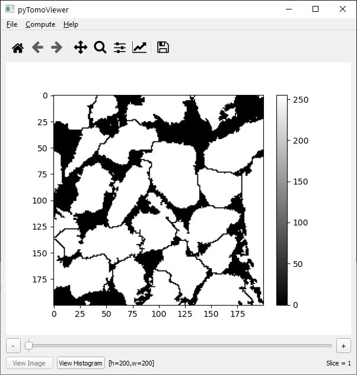

# Summary

[pytomoviewer.py](https://github.com/LCC-UFF/pytomoviewer) is an open-source Python script implementation to visualize a single TIFF [@TIFF1992] or a stack of TIFF images as well as to convert them into 8-bit RAW data. The Tagged Image File Format (TIFF) is a high-quality image file format commonly used to store micro-computed tomography (micro-CT) datasets. However, for developers of image-based numerical simulation software, such as in finite element analysis, this format can be inefficient for the representation of computational models. On the other hand, converting TIFF to binary grayscale images in a RAW format allows for flexibility in data manipulation, while preserves high image quality and reduces the required storage size. The resulting files are yet compatibles with several libraries such as @Qianqian2009.

The pytomoviewer (\autoref{fig:pic_pytomoviewer}) provides a Graphical User Interface (GUI) developed in PyQt5 and Matplotlib to allow: i) the interactive visualization of micro-CT data; ii) the generation of image histograms; iii) the fast export to RAW format (including a header file in JSON format); iv) the direct image resampling; v) the identification and removal of unconnected cluster of porous from the whole volume; vi) the simple generation of 3D data by replicating a single TIFF image; vii) and the conversion of a full grayscale image into a binary image.

Working directly with image files can be terribly slow and inefficient, especially when dealing with a large stack of images. In that sense, in the present implementation an alternative strategy is used, where the images are converted “on-the-fly” into NumPy [@NumPy2011] arrays. This strategy allows for the faster and more efficient image manipulation. After conversion, the images are instantaneously rendered on canvas using the plotting utilities of Matplotlib [@Hunter2007].

# Feature overview

When performing numerical analyses on physical models generated through image acquisition, only information from the voxels and pixels may not be sufficient. Therefore, it is necessary to inform otherwise the physical properties of each material related to the image. Pytomoviewer also provides to the users useful information such as image dimension, properties of each material according to the image data, number of materials, the volume fraction of each material, etc. All this information is saved in a JSON file (and alternatively in a Neutral file), since it can be easily read and edited.

In addition, to demonstrate how simple and straightforward is to include additional functionalities in the pytomoviewer in order to attend specific demands in an image-based simulation scheme, we have implemented a different feature that is the possibility to remove unconnected clusters of pores (black coloured voxels) from the image data. For example, in the context of Digital Petrophysics, it is particularly important to perform simulations of fluid flowing through the connected pores to predict the permeability of rock samples, as evaluated computationally in the works of @Sun2018, @Oliveira2020 and @Vianna2020. Therefore, in this context, the capability to identify the connected clusters of pores is extremely useful. The implemented algorithm benefits from SciPy [@SciPy2020] library to remove unconnected clusters of pores in a simple and fast way.

There was no initial intention to develop image-processing tasks in pytomoviewer, because there are in the literature several highly qualified open source softwares dedicated to these tasks, such as the ImageJ [@Schneider2012]. However, due to the simplicity in dealing with image data, pytomoviewer also allows to convert full grayscale images into binary images by performing a global segmentation (binarization) of the images using the histogram data and entering a threshold value (between 0 and 255). This is very useful and practical for image-based fluid analysis software, where 0 (black) represents the pore space in which the fluid flows and 255 (white) represents the solid region.

In homogenization analyses, most of analytical solutions available are only for problems in two-dimensions. However, they are particularly useful as benchmarks to validate three-dimensional numerical formulations. In that sense, Pytomoviewer offers a feature to generate 3D models from a single 2D slice by its automatic replication, and aid in the process of verification of numerical analysis software for 3D problems. Finally, it is also possible to resample the images to achieve different refinement levels, which provides an easy way to perform numerical convergence analysis.

# Acknowledgements
This research was carried out in association with the ongoing R&D project registered as ANP nº 21289-4, “Desenvolvimento de modelos matemáticos, estatísticos e computacionais para o aperfeiçoamento da caracterização petrofísica de reservatórios por Ressonância Magnética Nuclear (RMN)" (UFF/Shell Brasil/ANP), sponsored by Shell Brasil under the ANP R&D levy as “Compromisso de Investimentos com Pesquisa e Desenvolvimento”. The authors also recognize the support from CAPES, CNPq and FAPERJ.

# References
